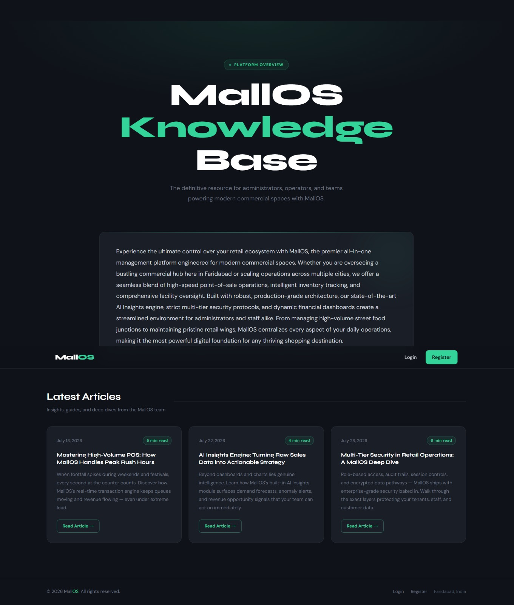
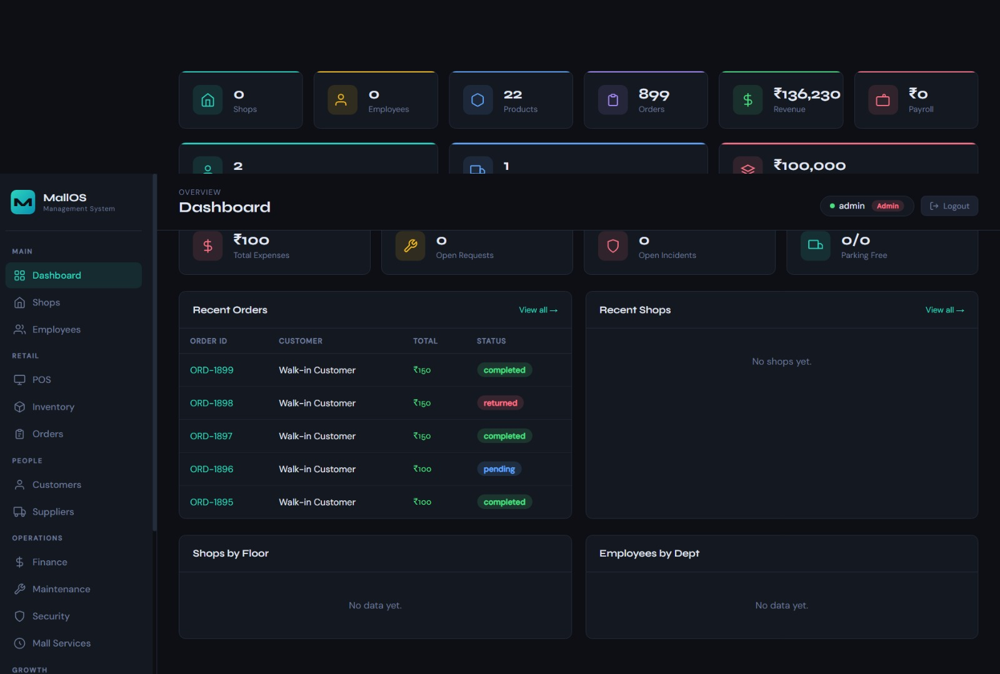
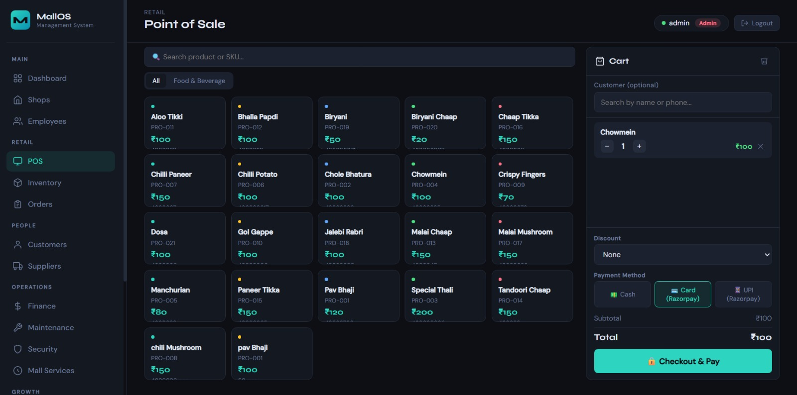
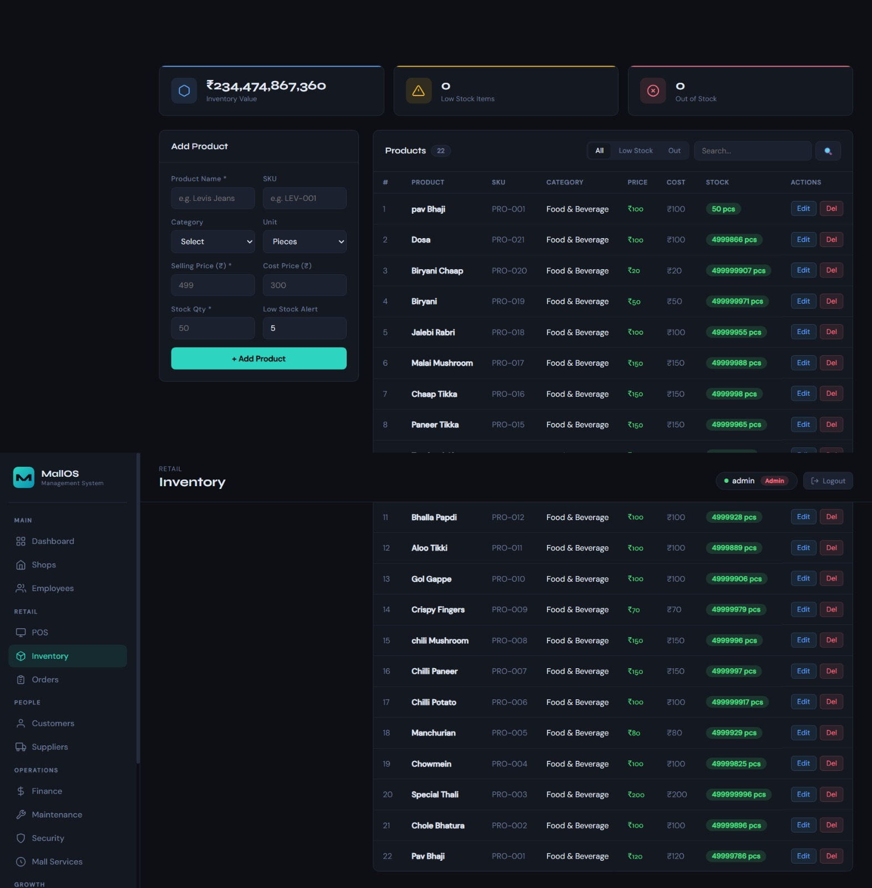
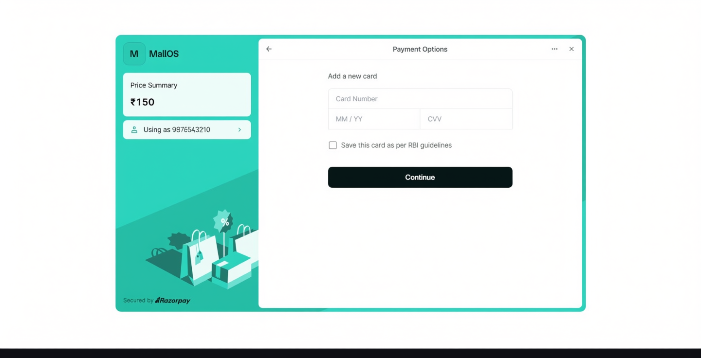
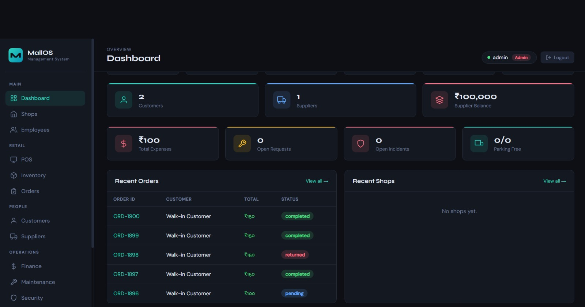
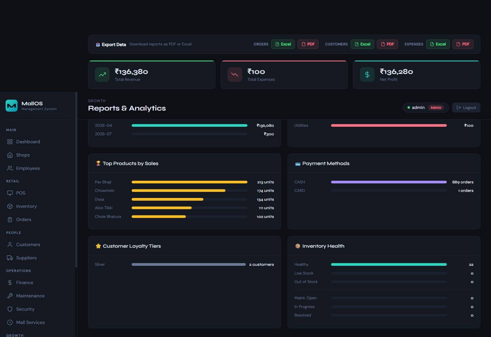
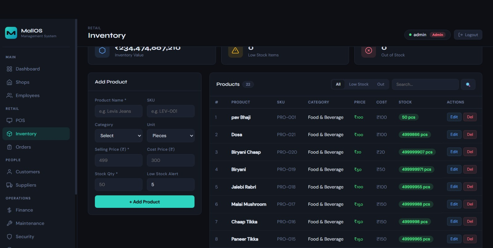

# 🏬 MallOS 2.0

## Smart Mall Operating System


A complete Mall Management System designed to digitize and simplify modern mall operations.

MallOS provides a centralized platform for managing POS billing, inventory, tenants, employees, suppliers, finance, security, and digital payments through an integrated management solution.

---

# 📌 About MallOS

MallOS started as a basic Mall Management System focused on solving daily operational challenges in mall administration.

With continuous improvements and new features, MallOS has evolved into a more advanced management platform.

**MallOS 2.0** introduces:

* Improved user experience
* Advanced management modules
* Secure authentication
* Digital payment integration
* Better business workflow handling

The goal remains the same:

> Build a smart and efficient operating system for mall management.

---

# 🚀 Features & Modules

## 🧾 POS & Billing System

Manage complete sales operations from a single platform.

Features:

* Point of Sale (POS)
* Order management
* Invoice generation
* Receipt generation
* Payment tracking
* QR based payments
* Razorpay payment integration

---

## 📦 Inventory Management

Control products and stock efficiently.

Features:

* Product management
* Stock monitoring
* Category management
* Supplier management
* Inventory updates

---

## 🏢 Tenant & Shop Management

Manage mall shops and tenant operations.

Features:

* Shop registration
* Tenant records
* Shop allocation
* Tenant information management
* Rental management support

---

## 👨‍💼 Employee Management

Maintain employee information and access control.

Features:

* Employee records
* Staff management
* Role-based permissions
* User activity management

---

## 💰 Finance Management

Track financial activities of the mall.

Features:

* Revenue tracking
* Transaction history
* Payment records
* Financial reports

---

## 🔐 Authentication & Security

Secure access management system.

Features:

* User authentication
* Role-based authorization
* Protected routes
* Admin controls

---

## 📊 Dashboard & Business Insights

Monitor important business information.

Features:

* Operational overview
* Data visualization
* Business monitoring
* Performance tracking

---

# 🏗️ System Architecture

```
                     Users
                       |
                       |
               Web Interface
                       |
                       |
              Flask Application
                       |
        --------------------------------
        |                              |
    MongoDB                      SQLite Auth DB
        |
 Business Data Management
```

---

# 🛠️ Tech Stack

## Backend

* Python
* Flask

## Frontend

* HTML5
* CSS3
* JavaScript

## Database

* MongoDB
* SQLite

## Payment Integration

* Razorpay API

## Development Tools

* Git
* GitHub
* VS Code

---

# 📂 Project Structure

```
MallOS-2.0/

│
├── app.py
├── auth.py
├── database.py
├── tenant.py
├── requirements.txt
├── README.md
│
├── static/
│   ├── css/
│   ├── js/
│   └── qr/
│
├── templates/
│
└── assets/
    └── screenshots/
```

---

# ⚙️ Installation & Setup

## 1. Clone Repository

```bash
git clone https://github.com/Jatinsaini001/MallOS-2.0.git
```

## 2. Open Project

```bash
cd MallOS-2.0
```

## 3. Install Dependencies

```bash
pip install -r requirements.txt
```

## 4. Environment Configuration

Create a `.env` file:

```
RAZORPAY_KEY_ID=your_key
RAZORPAY_KEY_SECRET=your_secret
```

## 5. Run Application

```bash
python app.py
```

---

# 📸 Application Screenshots

## 🏬 MallOS 2.0 (Latest Version)

### Landing Page



### Dashboard



### POS System



### Inventory Management



### Payment Module



---

# 🏬 MallOS 1.0 (Original Version)

MallOS 1.0 was the foundation version focused on basic mall management operations.

### Dashboard



### Reports & Analytics



### Inventory



---

# 📌 Version History

## 🚀 MallOS 2.0

Major improvements:

* Added Razorpay payment integration
* Improved authentication system
* Enhanced POS workflow
* Added advanced management modules
* Improved UI/UX
* Better project organization

---

## 🌱 MallOS 1.0

Initial release:

* Basic mall management system
* Shop management
* Inventory handling
* Core administrative operations

---

# 🔮 Future Roadmap

Future improvements planned:

* Cloud deployment
* Mobile application
* AI-powered business insights
* Multi-mall support
* Automated analytics reports
* Advanced tenant communication system

---

# 👨‍💻 Developer

## Jatin Saini

GitHub:
https://github.com/Jatinsaini001

---

# ⭐ Support

If you like this project, consider giving it a ⭐ on GitHub.

Your support helps improve MallOS further.
